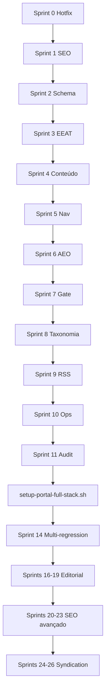

# Estrato — Prints Completos de Sprints (Zero → 100%)

**Versão:** 2.0.0 · 11/07/2026  
**Objetivo:** documento de análise e aprovação antes de iniciar execução do zero  
**Automação Fase 3:** `scripts/victor/setup-portal-full-stack.sh`

---

## Como usar este documento

1. **Revisar** cada sprint e marcar ✅ Aprovado / ❌ Ajustar / ⏸ Adiar
2. **Aprovar** a ordem de execução e dependências (diagrama §2)
3. **Confirmar** escopo por portal (matriz §3)
4. **Executar** com o script full-stack ou sprint a sprint
5. **Validar** com gate `--strict` antes de escalar tráfego

### Legenda de status no código

| Símbolo | Significado |
|---------|-------------|
| ✅ | Implementado no repo |
| ⚠️ | Parcial / só no finance / depende de secrets |
| ❌ | A implementar |
| 🔧 | Script existe, precisa parametrizar portal |

---

## 1. Índice de sprints

| Sprint | Nome | Fase | Portal(is) | Script principal |
|--------|------|------|------------|------------------|
| **0** | Hotfix imediato | Pré | finance | manual + patches |
| **1** | SEO fundação | 1 | todos | `setup-estrato-seo.sh` |
| **2** | Schema & OG | 1 | todos | `setup-estrato-schema.sh` |
| **3** | E-E-A-T | 1 | todos | `setup-institutional-portal.php` |
| **4** | Conteúdo | 1 | todos | `setup-estrato-content.sh` |
| **5** | Nav & visual | 1 | todos | `setup-sprint5-portal-nav.php` |
| **6** | AEO/GEO | 1 | todos | `setup-estrato-aeo.sh` |
| **7** | Gate 100% | 1 | todos | `setup-estrato-gate.sh` |
| **8** | Taxonomia + layout | 2 | todos | `setup-sprint8-portal-layout.php` |
| **9** | Curadoria RSS | 2 | todos | `setup-sprint9-rss-curation.php` |
| **10** | Ops contínua | 2 | todos | `setup-estrato-ops.sh` |
| **11** | Auditoria tax v2 | 2 | todos | `setup-sprint11-taxonomy-v2.php` |
| **8b** | Modelo G1 finance | 2+ | finance | `setup-sprint8-taxonomy.php` |
| **9-M…13-C** | Satélites nomeados | 3 | 1 cada | `setup-portal-full-stack.sh` |
| **14** | Anti-regressão multi | 3 | todos | YAML × 6 |
| **15** | Cross-linking rede | 3 | todos | novo script |
| **16–19** | Conteúdo editorial | 4 | todos | pipeline + enrich |
| **20–23** | SEO/AEO/GEO avançado | 5 | todos | GSC + sitemaps |
| **24–26** | Syndication + CI | 6 | rede | Docker + GH Actions |

---

## 2. Diagrama de dependências



**Regra de ouro:** não iniciar Sprint 8+ em produção até Sprint 7 `--strict` PASS no portal alvo.

---

## 3. Matriz por portal

| Portal ID | Domínio | Web root | Preset | Editorias | Subs | Colunas | Autores alvo |
|-----------|---------|----------|--------|-----------|------|---------|--------------|
| `estrato-finance` | estrato.cc | `/var/www/estrato.cc` | brasil-financeiro | 7 | 20 | 2 | 7 |
| `estrato-mind` | mente.estrato.cc | `/var/www/mente.estrato.cc` | brasil-mind | 3 | 10 | 0→2 | 3 |
| `estrato-lifestyle` | lifestyle.estrato.cc | `/var/www/lifestyle.estrato.cc` | brasil-lifestyle | 3 | 6 | 0→1 | 3 |
| `estrato-science` | science.estrato.cc | `/var/www/science.estrato.cc` | brasil-science | 3 | 6 | 0→1 | 3 |
| `estrato-sustain` | sustain.estrato.cc | `/var/www/sustain.estrato.cc` | brasil-sustain | 3 | 4 | 0→1 | 3 |
| `estrato-culture` | culture.estrato.cc | `/var/www/culture.estrato.cc` | brasil-culture | 2 | 4 | 0→2 | 2 |

---

## 4. Sprint 0 — Hotfix imediato (PRÉ-REQUISITO)

**Objetivo:** corrigir bugs que quebram o modelo G1 antes de recomeçar do zero.

| # | Tarefa | Artefato | Status |
|---|--------|----------|--------|
| 0.1 | Menu `Estrato Colunas` → location `secondary` | `setup-sprint8-portal-layout.php` | ✅ |
| 0.2 | Publicar `/privacidade/` (slug canônico) | `setup-institutional-portal.php` | ✅ |
| 0.3 | Wire `[estrato_home_columns]` na home finance | `setup-sprint8-taxonomy.php` | ⚠️ |
| 0.4 | Fix secondary=primary conflito Sprint 8 | `setup-sprint8-taxonomy.php` L208 | ⚠️ |
| 0.5 | `portal_id` em finance taxonomy | `estrato-finance-taxonomy.php` | ⚠️ |
| 0.6 | CI dedup feeds em subs/colunas | `check-portal-regression-ci.sh` | ⚠️ |
| 0.7 | `permalink_structure` nos novos WP | `deploy-victor-multi-portal.sh` | ✅ |

### Comandos Sprint 0

```bash
# Victor — finance
ssh root@187.127.12.186
cd /var/www/estrato/repo
sudo -u www-data wp --path=/var/www/estrato.cc eval-file scripts/victor/setup-sprint8-portal-layout.php
sudo -u www-data wp --path=/var/www/estrato.cc post list --name=politica-de-privacidade --field=ID \
  | xargs -I{} sudo -u www-data wp --path=/var/www/estrato.cc post update {} --post_status=publish --post_name=privacidade
```

### DoD Sprint 0

- [ ] `curl -s https://estrato.cc/ | grep -i "Radar B3"` retorna match
- [ ] `curl -sI https://estrato.cc/privacidade/ | head -1` → HTTP/2 200
- [ ] Menu secondary visível no HTML do header

**Aprovação Sprint 0:** ☐ Sim ☐ Não — Comentários: _______________

---

## 5. Sprint 1 — Fundação técnica SEO

**Objetivo:** robots, sitemaps, Yoast pt_BR — padrão BPMoney/Money Times.

**Referências:** BPMoney (robots), Money Times (news-sitemap), InfoMoney (titles)

| # | Tarefa | Artefato | Status |
|---|--------|----------|--------|
| S1.1 | Robots virtual (disallow admin, ?s=, xmlrpc) | `seo-robots.php` | ✅ |
| S1.2 | news-sitemap.xml + nginx fastcgi | `estrato-news-sitemap.php`, `setup-estrato-nginx-news-sitemap.sh` | ✅ |
| S1.3 | Yoast titles pt_BR por portal | `setup-estrato-seo.sh` + override no full-stack | 🔧 |
| S1.4 | Arquivar posts pré-2024 | `archive-legacy-posts.php` | ✅ |
| S1.5 | Fix sem-categoria | `fix-uncategorized.php` | ✅ |
| S1.6 | noindex categorias legado | `setup-estrato-seo.sh` | ✅ finance only |
| S1.7 | GSC + Bing Webmaster | Manual | ❌ humano |
| S1.8 | Permalink `/%postname%/` | `portal-env.sh` | ✅ |

### Regras anti-regressão alvo

| Regra | Descrição |
|-------|-----------|
| AR-ROBOTS-001 | robots.txt HTTP 200 |
| AR-ROBOTS-002 | Declara sitemap_index |
| AR-ROBOTS-003 | Disallow wp-admin |
| AR-ROBOTS-004 | Disallow ?s= |
| AR-ROBOTS-005 | Declara news-sitemap |
| AR-SITEMAP-001 | sitemap_index HTTP 200 |
| AR-SCHEMA-010 | Title home não genérico |

### Comando Sprint 1 (qualquer portal)

```bash
ESTRATO_PORTAL=estrato-mind WEB_ROOT=/var/www/mente.estrato.cc \
  bash scripts/victor/setup-estrato-seo.sh
```

### DoD Sprint 1

```bash
curl -s https://mente.estrato.cc/robots.txt | grep -E 'wp-admin|news-sitemap'
curl -sI https://mente.estrato.cc/news-sitemap.xml | head -1  # 200
curl -sI https://mente.estrato.cc/sitemap_index.xml | head -1  # 200
```

- [ ] robots completo
- [ ] news-sitemap 200
- [ ] sitemap_index 200
- [ ] 0 posts sem-categoria (ou <5)

**Aprovação Sprint 1:** ☐ Sim ☐ Não

---

## 6. Sprint 2 — Schema & Meta (rich results)

**Objetivo:** NewsMediaOrganization + NewsArticle unificado — padrão Metrópoles/ND Mais.

| # | Tarefa | Artefato | Status |
|---|--------|----------|--------|
| S2.1 | NewsMediaOrganization na home | `seo-schema.php` | ✅ |
| S2.2 | Desativar JSON-LD duplicado PressGrid | `seo-schema.php` | ✅ |
| S2.3 | Organization sameAs (social) | Yoast WP-CLI | ⚠️ |
| S2.4 | OG image 1200×630 default | Yoast | ⚠️ |
| S2.5 | Person + jobTitle por autor | `seo-schema.php` | ✅ |
| S2.6 | Breadcrumb visível no single | PressGrid / stub | ⚠️ |

### Regras alvo

AR-SCHEMA-001 a AR-SCHEMA-009 (sem duplicação Article)

### Comando Sprint 2

```bash
WEB_ROOT=/var/www/science.estrato.cc bash scripts/victor/setup-estrato-schema.sh
```

### DoD Sprint 2

```bash
curl -s https://science.estrato.cc/ | grep -o '@type":"NewsMediaOrganization'
curl -s https://science.estrato.cc/$(wp post list --field=post_name --posts_per_page=1)/ | grep -o 'NewsArticle'
# Rich Results Test manual — 0 erros em amostra de 3 URLs
```

**Aprovação Sprint 2:** ☐ Sim ☐ Não

---

## 7. Sprint 3 — E-E-A-T & Institucional

**Objetivo:** confiança YMYL — Jota/Valor/Poder360.

| # | Tarefa | Artefato | Status |
|---|--------|----------|--------|
| S3.1 | `/sobre/` | `setup-institutional-portal.php` | ✅ genérico |
| S3.2 | `/politica-editorial/` | idem | ✅ |
| S3.3 | `/contato/` | idem | ✅ |
| S3.4 | `/privacidade/` | idem (slug canônico) | ✅ |
| S3.5 | Autores por editoria | `setup-estrato-authors-wave0.sh` | ✅ finance only |
| S3.6 | Bios + avatars + job_title | `author-personas.php` | ✅ |
| S3.7 | Pipeline → author_id | `wp_bridge.py` | ⚠️ Victor only |
| S3.8 | Footer menu institucional | `setup-institutional-portal.php` | ✅ |
| S3.9 | Remover "Página de exemplo" | full-stack Sprint 0 | ✅ |

### Autores finance (7)

| Slug | Nome | Editoria |
|------|------|----------|
| ana-economia | Ana Ribeiro | economia |
| marcos-mercados | Marcos Vieira | mercados |
| lucia-negocios | Lúcia Mendes | negocios |
| pedro-financas | Pedro Alves | financas-pessoais |
| rafa-cripto | Rafa Costa | criptomoedas |
| julia-agro | Júlia Santos | agronegocio |
| henrique-mundo | Henrique Lima | mundo |

### Autores satélites (a criar — Sprint 16)

| Portal | Autores planejados |
|--------|-------------------|
| mind | cognição, filosofia, FIRE |
| lifestyle | sabores, ar livre, hobbies |
| science | neuro, bio, IA |
| sustain | agro, alt econ, nomadismo |
| culture | jogos, narrativas |

### Comando Sprint 3

```bash
ESTRATO_PORTAL=estrato-culture WEB_ROOT=/var/www/culture.estrato.cc \
  sudo -u www-data wp --path=/var/www/culture.estrato.cc \
  eval-file scripts/victor/setup-institutional-portal.php
```

### DoD Sprint 3

| Regra | Meta |
|-------|------|
| AR-EEAT-001..004 | 4 páginas HTTP 200 |
| AR-EEAT-005 | ≥3 autores (satélite) / ≥7 (finance) |

**Aprovação Sprint 3:** ☐ Sim ☐ Não

---

## 8. Sprint 4 — Conteúdo & Pipeline

**Objetivo:** sair do thin content — padrão Valor/InfoMoney.

| # | Tarefa | Artefato | Status |
|---|--------|----------|--------|
| S4.1 | Rejeitar post <300 palavras | `patch-writer-s4.py` | ⚠️ Victor pipeline |
| S4.2 | Template AEO no prompt | `content/templates/post-aeo.md` | ❌ |
| S4.3 | 3 internal links/post | `wp-internal-linker.php` | ✅ |
| S4.4 | Enrich thin posts | `enrich-all-thin-posts.php` | ✅ |
| S4.5 | noindex <200 palavras | `content-quality.php` | ✅ |
| S4.6 | 1 longform/semana/editoria | pipeline mode `analysis` | ❌ |
| S4.7 | 100% featured image | `backfill-featured-images.php` | ✅ |

### DoD Sprint 4

| Regra | Meta |
|-------|------|
| AR-CONTENT-001 | 0 posts <200 palavras |
| AR-CONTENT-002 | ≥80% com 300+ palavras |
| AR-CONTENT-004 | 100% com thumbnail |

### Comando Sprint 4

```bash
WEB_ROOT=/var/www/estrato.cc bash scripts/victor/setup-estrato-content.sh
# Satélites novos: pode pular com --skip-content no full-stack
```

**Aprovação Sprint 4:** ☐ Sim ☐ Não

---

## 9. Sprint 5 — Estrutura, navegação & visual

**Objetivo:** home e silos — padrão G1/InfoMoney/Money Times.

| # | Tarefa | Finance | Satélites | Status |
|---|--------|---------|-----------|--------|
| S5.1 | Layout PressGrid por editoria | Sprint 8 finance | `setup-sprint8-portal-layout.php` | ✅ |
| S5.2 | Forex ticker topbar | ✅ | N/A | ⚠️ |
| S5.3 | Hubs `/tudo-sobre/` | 7 hubs finance | 2-3 por portal (Sprint 15) | ⚠️ |
| S5.4 | SEO intro 150 pal editoria | Sprint 5/8 | `setup-sprint5-portal-nav.php` | ✅ |
| S5.5 | `/cotacoes/` | ✅ finance | N/A | ✅ |
| S5.6 | Mais lidas 7 dias | shortcode | shortcode | ⚠️ |
| S5.7 | Newsletter CF7 | placeholder | placeholder | ⚠️ |
| S5.8 | Bylines visíveis | `nav-visual.php` | idem | ✅ |
| S5.9 | Tempo leitura | PHP snippet | idem | ⚠️ |
| S5.10 | Footer 4 colunas | Sprint 5 | `setup-sprint5-portal-nav.php` | ✅ |

### Hubs finance (existentes)

`selic`, `ibovespa`, `dolar`, `cripto`, `inflacao`, `tributacao`, `agronegocio`

### Hubs satélites (planejar — Sprint 15)

| Portal | Hubs sugeridos |
|--------|----------------|
| mind | `/tudo-sobre/fire/`, `/tudo-sobre/estoicismo/`, `/tudo-sobre/pkm/` |
| lifestyle | `/tudo-sobre/cafe/`, `/tudo-sobre/cerveja/`, `/tudo-sobre/aquarismo/` |
| science | `/tudo-sobre/sono/`, `/tudo-sobre/biohacking/`, `/tudo-sobre/ia/` |
| sustain | `/tudo-sobre/agroecologia/`, `/tudo-sobre/cooperativismo/` |
| culture | `/tudo-sobre/rpg/`, `/tudo-sobre/board-games/` |

### Comando Sprint 5

```bash
# Finance
bash scripts/victor/setup-estrato-nav.sh

# Satélite
ESTRATO_PORTAL=estrato-lifestyle sudo -u www-data wp --path=/var/www/lifestyle.estrato.cc \
  eval-file scripts/victor/setup-sprint5-portal-nav.php
```

**Aprovação Sprint 5:** ☐ Sim ☐ Não

---

## 10. Sprint 6 — AEO, GEO & Indexação

**Objetivo:** visibilidade em IA + Google News — Folha/BPMoney/Metrópoles.

| # | Tarefa | Artefato | Status |
|---|--------|----------|--------|
| S6.1 | `llms.txt` + `llms-full.txt` | `seo-aeo.php`, assets | ✅ |
| S6.2 | FAQPage nos hubs | `seo-aeo.php` | ⚠️ template genérico |
| S6.3 | Regras user-agent IA no robots | `seo-robots.php` | ✅ |
| S6.4 | IndexNow on publish | bridge + `seo-aeo.php` | ✅ |
| S6.5 | GSC bot + ping | `index-bot/` | ⚠️ precisa SA key |
| S6.6 | Cron news-sitemap hourly | WP cron | ✅ |
| S6.7 | Google News Publisher Center | Manual | ❌ |
| S6.8 | `ads.txt` placeholder | assets | ✅ |

### DoD Sprint 6

| Regra | Meta |
|-------|------|
| AR-AEO-001 | llms.txt HTTP 200 |
| AR-AEO-002 | ≥3 FAQs em hubs |
| AR-INDEX-001/002 | IndexNow + news-sitemap ativo |

### Comando Sprint 6

```bash
WEB_ROOT=/var/www/mente.estrato.cc bash scripts/victor/setup-estrato-aeo.sh
```

**Aprovação Sprint 6:** ☐ Sim ☐ Não

---

## 11. Sprint 7 — Gate 100% & Polish

**Objetivo:** `check-portal-regression.sh --strict` → PASS.

| # | Tarefa | Artefato |
|---|--------|----------|
| S7.1 | Regression strict até 0 blockers | `check-portal-regression.sh` |
| S7.2 | Resolver warnings | manual |
| S7.3 | Lighthouse LCP <2.5s | manual |
| S7.4 | Rich Results 0 erros (10 URLs) | manual |
| S7.5 | GSC cobertura >90% | após S6.5 |
| S7.6 | Runbook produção | docs |
| S7.7 | Tag git `estrato-portal-v1.0` | git |

### Gate de saída Fase 1

```
✅ check-portal-regression.sh --strict → PASS
✅ 4 páginas institucionais publicadas
✅ news-sitemap + llms.txt + robots completo
✅ ≥80% posts 300+ palavras (finance)
✅ Layout home por editoria
✅ Health API 1.6.0
```

### Comando Sprint 7

```bash
WEB_ROOT=/var/www/estrato.cc bash scripts/victor/setup-estrato-gate.sh
```

**Aprovação Sprint 7:** ☐ Sim ☐ Não

---

## 12. Sprints 8–11 — Taxonomia, RSS, Ops (Fase 2)

### Sprint 8 — Taxonomia + layout

| # | Tarefa | Finance | Satélites |
|---|--------|---------|-----------|
| S8.1 | Sync taxonomia v2 | `setup-sprint8-taxonomy.php` | `apply-portal-config.php` |
| S8.2 | Merge legado | `merge-legacy-categories.php` | skip |
| S8.3 | Layout 1:1 editorias | 10 seções | `setup-sprint8-portal-layout.php` |
| S8.4 | Colunas → secondary menu | Radar B3, Painel Selic | futuro Sprint 8b |
| S8.5 | SEO descriptions | taxonomy PHP | auto Sprint 5 |
| S8.6 | `[estrato_home_columns]` | finance only | futuro |

### Sprint 9 — Curadoria RSS

| # | Tarefa | Artefato |
|---|--------|----------|
| S9.1 | Validar feeds HTTP | `validate-rss-feeds.py` |
| S9.2 | Matriz fonte×categoria | taxonomy PHP |
| S9.3 | Feed health cron | `rss-curation.php` |
| S9.4 | Dedup cross-tier | `rss-curation.php` |
| S9.5 | pipeline_primary 2/15/h | `estrato-rss-bootstrap.php` |
| S9.6 | Rebuild menus | `taxonomy-sync.php` |
| S9.7 | Indexação por categoria | `index-by-category.py` |

### Sprint 10 — Ops contínua

| # | Tarefa | Artefato |
|---|--------|----------|
| S10.1 | CI anti-regressão blocking | `.github/workflows/` |
| S10.2 | Relatório GSC semanal | `report-gsc-weekly.php` |
| S10.3 | Manutenção mensal | `ops-monthly-maintenance.php` |

### Sprint 11 — Auditoria taxonomia v2

| # | Tarefa | Artefato |
|---|--------|----------|
| S11.1 | Inventário editorias/subs/colunas | `setup-sprint11-taxonomy-v2.php` |
| S11.2 | Log import matrix | WP option |
| S11.3 | Validar keywords vs feeds | manual |

**Aprovação Sprints 8–11:** ☐ Sim ☐ Não

---

## 13. Fase 3 — `setup-portal-full-stack.sh`

### O que o script faz

Orquestra **Sprints 0→11** para qualquer portal em uma única execução:

```
Sprint 0  → sync plugins, permalinks, remove página exemplo
Sprint 1  → SEO (robots, Yoast, news-sitemap)
Sprint 2  → Schema
Sprint 3  → Institucional genérico + privacidade + autores (finance)
Sprint 4  → Conteúdo (opcional --skip-content)
Sprint 5  → Nav/footer satélite OU nav finance completo
Sprint 6  → AEO/GEO
Sprint 7  → Gate cleanup
Sprint 8  → Taxonomia + layout
Sprint 9  → Curadoria RSS
Sprint 10 → Ops crons
Sprint 11 → Auditoria tax v2
Final     → curl checks (health, robots, llms, sitemap, institucional)
```

### Uso

```bash
# No Victor (SSH)
cd /var/www/estrato/repo
git pull origin cursor/taxonomy-rss-keywords-2c04

# Um satélite do zero
bash scripts/victor/setup-portal-full-stack.sh estrato-mind --strict-gate

# Retomar do Sprint 5
bash scripts/victor/setup-portal-full-stack.sh estrato-science --from 5

# Simular sem executar
bash scripts/victor/setup-portal-full-stack.sh estrato-culture --dry-run

# Finance completo (re-run)
bash scripts/victor/setup-portal-full-stack.sh estrato-finance --strict-gate

# Todos os satélites em sequência
for p in estrato-mind estrato-lifestyle estrato-science estrato-sustain estrato-culture; do
  bash scripts/victor/setup-portal-full-stack.sh "$p" --strict-gate
done
```

### Flags

| Flag | Efeito |
|------|--------|
| `--from N` | Pula sprints < N |
| `--dry-run` | Só loga comandos |
| `--strict-gate` | Roda regression --strict no Sprint 7 |
| `--skip-content` | Pula Sprint 4 (portais novos sem posts) |

### Variáveis de ambiente

| Var | Default | Descrição |
|-----|---------|-----------|
| `ESTRATO_REPO` | `/var/www/estrato/repo` | Repo no Victor |
| `ESTRATO_VPS_IP` | `187.127.12.186` | IP para curl checks |
| `WEB_ROOT` | do YAML | Override path WP |
| `SKIP_LEGACY_MERGE` | `1` | Satélites não fazem merge legado |
| `SYNC_FIRESFERA` | `0` | `1` para re-sync FIRE no mind |

### Logs

```
/var/www/estrato/repo/logs/full-stack/<portal_id>-<timestamp>.log
```

### Arquivos novos (Fase 3)

| Arquivo | Função |
|---------|--------|
| `scripts/victor/setup-portal-full-stack.sh` | Orquestrador |
| `scripts/victor/lib/portal-env.sh` | Resolve YAML → env |
| `scripts/victor/setup-institutional-portal.php` | E-E-A-T genérico |
| `scripts/victor/setup-sprint5-portal-nav.php` | Nav/footer satélites |
| `scripts/victor/setup-sprint8-portal-layout.php` | Layout home genérico |

### DoD full-stack (por portal)

| Check | URL/comando | Esperado |
|-------|-------------|----------|
| Home | `/` | 200 |
| Health | `/wp-json/estrato/v1/health` | `{"ok":true}` |
| Robots | `/robots.txt` | 200 + sitemap |
| News | `/news-sitemap.xml` | 200 |
| Sitemap | `/sitemap_index.xml` | 200 |
| GEO | `/llms.txt` | 200 |
| Sobre | `/sobre/` | 200 |
| Privacidade | `/privacidade/` | 200 |
| Layout | WP option | ≥3 seções PressGrid |
| Gate | regression --strict | PASS |

**Aprovação full-stack:** ☐ Sim ☐ Não

---

## 14. Sprints 8b–15 — Pós paridade (detalhe)

### Sprint 8b — Modelo G1 finance (após gate)

- Sub-nav dropdown no menu
- Archive template com hero + sub-nav
- Ticker Ibovespa/USD/Selic real
- +2 colunas-marca (Radar Cripto, Agro Hoje)
- Plantão B3

### Sprints 9-M a 13-C — Nomeados por portal

| Sprint | Portal | Foco exclusivo |
|--------|--------|----------------|
| S9-M | mind | FIRESFERA 57 feeds, hubs FIRE |
| S10-L | lifestyle | Coluna Café&Cerveja, expandir movimento-ar-livre |
| S11-S | science | Coluna Biohacking BR |
| S12-U | sustain | Expandir agro + nomadismo nichos |
| S13-C | culture | Colunas Mesa RPG + Som de Nicho |

### Sprint 14 — Anti-regressão multi-portal

Criar `portals/estrato-anti-regression-{portal}.yaml` × 5  
Estender `check-portal-regression.sh` para aceitar `ESTRATO_PORTAL`

### Sprint 15 — Cross-linking rede

- Widget "Na rede Estrato" no footer
- Links contextuais finance ↔ mind (FIRE)
- Hub pages por satélite

**Aprovação Sprints 8b–15:** ☐ Sim ☐ Não

---

## 15. Sprints 16–26 — Conteúdo, SEO avançado, escala

### Fase 4 — Conteúdo editorial (16–19)

| Sprint | Entregável |
|--------|------------|
| S16 | 3–7 autores por portal com Person schema |
| S17 | Template AEO em 100% novos posts |
| S18 | 2 longforms/semana/portal |
| S19 | `/cotacoes/` com API real (finance) |

### Fase 5 — SEO/AEO/GEO avançado (20–23)

| Sprint | Entregável |
|--------|------------|
| S20 | Sitemap por editoria + ping IndexNow |
| S21 | GSC SA key + crons + relatório |
| S22 | HowTo/Speakable + llms-full por portal |
| S23 | Google News Publisher Center |

### Fase 6 — Syndication + CI (24–26)

| Sprint | Entregável |
|--------|------------|
| S24 | Docker stack live (FreshRSS, bridge, social) |
| S25 | CI deploy Victor blocking |
| S26 | Portal-mãe estrato.cc como hub da rede |

**Aprovação Sprints 16–26:** ☐ Sim ☐ Não

---

## 16. Ordem de execução recomendada (do zero)

```
Semana operacional 1 — Fundação
├── Aprovar este documento
├── Sprint 0 (hotfix finance)
├── setup-portal-full-stack.sh estrato-finance --strict-gate
└── Baseline regression log

Semana operacional 2 — Satélites
├── full-stack estrato-mind
├── full-stack estrato-lifestyle
├── full-stack estrato-science
├── full-stack estrato-sustain
└── full-stack estrato-culture

Semana operacional 3 — G1 + conteúdo
├── Sprint 8b (finance G1)
├── Sprint 14 (multi-regression)
├── Sprint 16 (autores satélites)
└── Sprint 17 (template AEO)

Semana operacional 4+ — Escala
├── Sprints 20–23 (GSC, GEO, Google News)
└── Sprints 24–26 (syndication, CI)
```

---

## 17. Checklist mestre de aprovação (assinatura)

| Item | Aprovador | Data | OK |
|------|-----------|------|-----|
| Escopo Sprints 0–7 | | | ☐ |
| Script full-stack Fase 3 | | | ☐ |
| Matriz 6 portais | | | ☐ |
| Sprints 8b–15 (G1 + satélites) | | | ☐ |
| Sprints 16–26 (editorial + escala) | | | ☐ |
| Ordem de execução §16 | | | ☐ |
| Budget Victor (SSH/crons) | | | ☐ |
| GSC / Google News (humano) | | | ☐ |

**Comentários gerais:**

```
_________________________________________________________________
_________________________________________________________________
_________________________________________________________________
```

---

## 18. Comandos rápidos (cola no terminal)

```bash
# === LOCAL (CI estático) ===
bash scripts/victor/check-portal-regression-ci.sh

# === VICTOR — um portal do zero ===
ssh -i .ssh-keys/estrato-cc/id_ed25519 root@187.127.12.186
cd /var/www/estrato/repo && git pull
bash scripts/victor/setup-portal-full-stack.sh estrato-mind --strict-gate 2>&1 | tee /tmp/mind-full.log

# === VICTOR — todos satélites ===
for p in estrato-mind estrato-lifestyle estrato-science estrato-sustain estrato-culture; do
  bash scripts/victor/setup-portal-full-stack.sh "$p" --skip-content --strict-gate
done

# === Gate manual ===
ESTRATO_PORTAL=estrato-mind WEB_ROOT=/var/www/mente.estrato.cc \
  bash scripts/victor/check-portal-regression.sh --strict
```

---

*Documento gerado para análise e aprovação. Após OK, iniciar pelo Sprint 0 + full-stack no portal piloto (`estrato-mind` recomendado como segundo após finance).*
